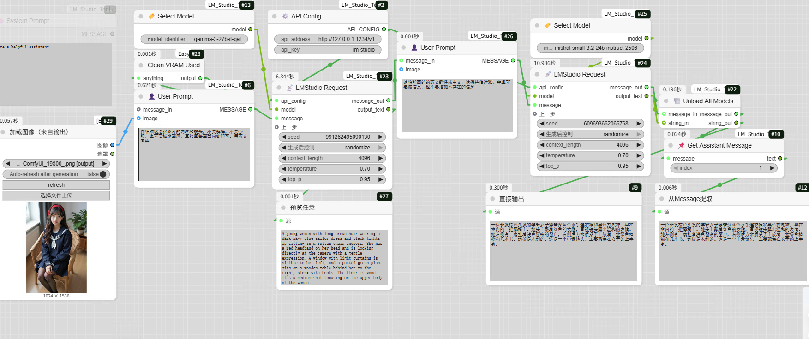

# LM Studio Tools for ComfyUI

这是一个为 [ComfyUI](https://github.com/comfyanonymous/ComfyUI) 设计的自定义节点包，它将强大的 [LM Studio](https://lmstudio.ai/) 无缝集成到你的工作流中，让你能够利用本地运行的大语言模型（LLM）进行文本生成、图像理解（Vision）等多种任务。

预览：



## ✨ 功能特性

*   **本地 LLM 集成**: 直接在 ComfyUI 中调用 LM Studio 部署的任何模型。
*   **文本与多模态支持**: 支持纯文本对话和“文本+图片”的多模态输入。
*   **完整的对话流控制**: 通过链接 `Message` 对象，可以构建包含系统提示、多轮用户/助手对话的完整上下文。系统提示词输入框支持连接其他节点，实现动态提示词配置。
*   **参数化请求**: 精确控制 `temperature`, `top_p`, `seed` 等关键生成参数。
*   **模型管理**: 包含一个节点，可以通过调用 LM Studio 的命令行工具来卸载模型，释放显存。
*   **易于使用**: 节点设计直观，通过 emoji 图标清晰区分功能，符合 ComfyUI 的使用习惯。

## 📋 先决条件

在安装此插件之前，请确保你已经准备好以下环境：

1.  **ComfyUI**: 你的系统中已成功安装并能正常运行 ComfyUI。
2.  **LM Studio**: 你已经下载并安装了 LM Studio 桌面应用。
3.  **LM Studio CLI (lms)**: **（可选）** 如果你想使用 `📡 LMStudio 请求` 节点的自动卸载模型功能，需要安装 LM Studio 的命令行工具 (`lms`) 并将其添加到系统的环境变量 `PATH` 中。
    *   在 LM Studio 应用中，点击底部状态栏的 `</>` 图标，或直接运行以下命令来安装 CLI：
    *   **macOS / Linux**:
        ```bash
        ~/.lmstudio/bin/lms bootstrap
        ```
    *   **Windows (在 CMD 或 PowerShell 中运行)**:
        ```cmd
        %USERPROFILE%\.lmstudio\bin\lms.exe bootstrap
        ```
    *   安装后，关闭并重新打开你的终端，输入 `lms -v`，如果能看到版本号，则表示安装成功。


**手动安装**:
1.  下载本仓库的 ZIP 压缩包。
2.  解压后，将文件夹重命名为 `LM_Studio_Tools`。
3.  将整个 `LM_Studio_Tools` 文件夹放入 ComfyUI 的 `custom_nodes` 目录下。
4.  **重启 ComfyUI**。

## 🧩 节点说明

### 👤 综合提示词
创建或继续对话，整合了系统提示词和用户提示词，可以选择性地附带一张或多张图片。支持多轮对话。
*   **输入**:
    *   `system_prompt`: 多行文本框，定义系统提示词来设定 AI 的角色和行为（默认: "你是一个有帮助的助手。"）。此输入框支持连接其他节点的文本输出。仅在没有传入消息历史时生效
    *   `user_prompt`: 多行文本框，用户的提问（必填）
    *   `message_in` (可选): 从上一个节点传入的 `Message` 对象，用于多轮对话。如果提供此输入，系统提示词将被忽略
    *   `image` (可选): 从 `Load Image` 等节点传入的图像。支持通过合并批次节点输入多张图片的batch
*   **输出**:
    *   `MESSAGE`: 包含完整对话历史的 `Message` 对象

### 📡 LMStudio 请求
将构建好的对话上下文发送到 LM Studio API，并获取模型的回复。此节点整合了 API 配置、模型选择和完成后卸载模型的功能。
*   **输入**:
    *   `api_address`: LM Studio API 地址（默认: `http://127.0.0.1:1234/v1`）
    *   `api_key`: API 密钥（默认: `lm-studio`）
    *   `model_identifier`: 模型标识符字符串。如何获取？
        1. 在 LM Studio 中加载一个模型
        2. 切换到 "Local Server" 标签页
        3. 在页面顶部，你会看到 "Select a model to load"，下方即是模型的标识符，复制它
    *   `message`: 包含完整对话上下文的 `Message` 对象
    *   `seed`: 随机种子，`-1` 表示随机。用于复现结果
    *   `context_length`: 上下文长度（默认: 4096）
    *   `temperature`: 温度参数，控制生成的随机性（默认: 0.7）
    *   `top_p`: Top-p 采样参数（默认: 0.95）
    *   `unload_after_completion`: 完成后是否卸载模型（默认: False）。启用后会在请求完成后自动执行 `lms unload --all` 命令释放显存
    *   `上一步` (可选): 任意类型的输入，仅用于确保工作流的执行顺序
*   **输出**:
    *   `消息输出`: 追加了模型回复后的完整 `Message` 对象
    *   `文本输出`: 本次请求中模型生成的纯文本回复
*   **注意**: 如果启用了 `unload_after_completion`，需要 `lms` CLI 已正确安装并配置在系统 `PATH` 中。

### 📌 获取助手消息
从对话历史中提取指定索引的助手（模型）回复。
*   **输入**:
    *   `message`: 包含对话历史的 `Message` 对象
    *   `index`: 整数索引（-9999 到 9999，不支持 0）
        - 正数：`1` 代表第一条，`2` 代表第二条，以此类推
        - 负数：`-1` 代表最后一条（倒数第一条），`-2` 代表倒数第二条，以此类推
*   **输出**:
    *   `文本`: 提取出的纯文本回复

## 💡 示例工作流

### 1. 基础文本对话

这是一个最简单的工作流，用于和模型进行单轮对话。

`👤 综合提示词` -> `📡 LMStudio 请求`

*   在 `综合提示词` 节点中填写用户问题，可选填写系统提示词
*   在 `LMStudio 请求` 节点中配置 API 地址、密钥和模型标识符
*   最终 `LMStudio 请求` 的 `文本输出` 就是模型的回复

### 2. 多模态（视觉）对话

向模型提问关于一张或多张图片的问题。

`Load Image` -> `👤 综合提示词` 的 `image` 输入 -> `📡 LMStudio 请求`

### 3. 多轮对话

你可以将一个 `LMStudio 请求` 的 `消息输出` 连接到下一个 `综合提示词` 的 `message_in` 输入，从而实现多轮对话。在最后一个请求节点中，启用 `unload_after_completion` 选项即可在完成后自动卸载模型释放显存。

`👤 综合提示词` -> `📡 LMStudio 请求` -> `👤 综合提示词` (连接 message_in) -> `📡 LMStudio 请求` (启用 unload_after_completion)

### 4. 使用文本节点作为系统提示词

你可以使用 ComfyUI 的文本节点（如 `多行文本` 节点）连接到 `综合提示词` 的 `system_prompt` 输入，实现动态的系统提示词。

`多行文本` -> `👤 综合提示词` 的 `system_prompt` 输入 -> `📡 LMStudio 请求`


## 📜 许可证

本项目采用 [MIT License](./LICENSE) 开源。

---